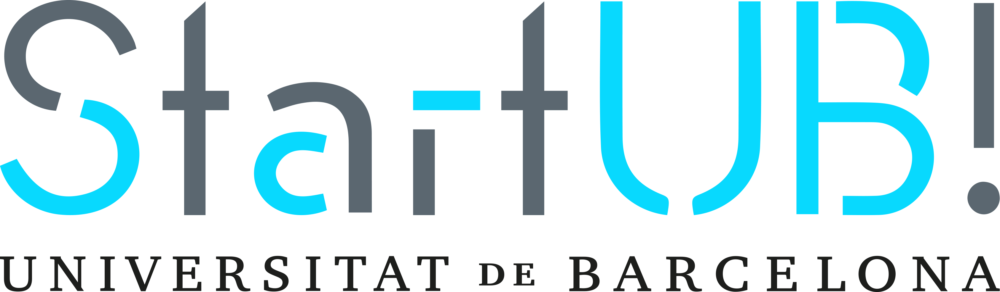

[rainbow]: media/rainbow.png "VSCode with rainbow"
[open]: media/Open.png "Open with VSCode"
[vscode]: media/VSCodePrepared.png "VsCode Prepared"
[usercsvlayout]: media/userCSVLayout.png "CSV LINT with error"
[csvlint]: media/csvlint.png "CSV LINT"
[badcsvlint]: media/badcsvlint.png "CSV LINT with error"

<p align="center">
<br/>
<br/>
<br/>
   
<br/>
<br/>
</p>

# iday_csv_templates

This repository contains the data template sample for initial iday set-up and instructions to generate the data for your Iday event.

# Getting started

## Prepare the environment

- The firts step is prepare your computer to work and verify csv files.
  - You can use the csv editor that you preffer, but it is necesary to avoid to add formating or extra information to these files
  - Due that we recomend to use VSCode to edit and check the format of csv files. [Download here](https://code.visualstudio.com/)
  - After download VSCode it will be very recomendable to add the extension **Rainbow CSV** which includes a csv validator.
  - After all opening a csv using VSCode will be seen like this:
    <br/><br/>
    ![alt text][rainbow]

## Download the files

[Download the files here](https://github.com/The-three-lords/iday_csv_templates/archive/refs/heads/New-instructions.zip)

After unzip this zip you can find 2 folders and one Readme.md.

- The **readme.md** is the file which contain the instructions.
- The **media** folder contains images for the intructions file
- The **csv-samples** is the folder which you are going to change and send to the set-up responsable of your iday event.
- From this point we only deal with the files inside **csv-samples** folder.

> Notice: If you are familiar with git repository, you can ask to the set-up responsable of your iday event for a branch in a private repository to add, check and upload the your iday event data

## Open csv-samples as a proyect in your VSCode

To open csv-samples, right-click on csv-samples folder and click on Open with --> Viscual code.
<br/><br/>
![alt text][open]

After that you are prepared to change and maniputale the sample file data with the information necessary for your iday event.
![alt text][vscode]

# Adding your iday event data

In this section we will check the folder files structure, the data structure, the meaning of every column of information and the way to validate it.

## Folder structure

In csv-samples folder you can find 2 files

- user.csv
- links.csv

## user.csv

This file contains the sample data of a configuration of:

- 3 hipothetical reponsables
- 2 hiothetical slots for responsables who are necessary in last time
- 29 hipothetical users
- 7 hipothetical user slots for real groups (because there are 7 real groups)
- 21 hipothetical user slots for slot groups

![alt text][usercsvlayout]

#### Columns of the file

- **id:** This is the technical identificator of the user inside the application.

  - Starting at **10000** all users shoud have a correlative incremental number.
  - Starting at **1000000** for facilitators/responsables, all facilitators/responsables shoud have a correlative incremental number.

- **grupo_id**: This column is the connection between groups and users. Here you have to put the identificator of the group which user belongs.

  > 🛑 All facilitator/responsable user have to be connected with group 217

  > 🛑 Users groups identificator have to start by 218, to necessary number. Every new number will be a new group. Thus all members of a group have to share the same number group identificator

- **email**: The email of the user
- **first_name**: The first name of the user
- **sur_name**: The sur name of the user
- **⚠️roles**: The posible values in this column are:

  - ROLE_ADMIN
  - ROLE_RESPONSABLE
  - ROLE_USER

    > ⚠️ If you create a ROLE_USER user, copy a ROLE_USER row, If yout create a ROLE_RESPONSABLE user, copy a ROLE_RESPONSABLE row. Thus keep the role in this row.

    > ⚠️ You can create a user with role admin if you want.

- **⚠️password**: The password of the user
  > ⚠️ If you create a ROLE_USER user, copy a ROLE_USER row, If yout create a ROLE_RESPONSABLE user, copy a ROLE_RESPONSABLE row. Thus keep the password of this row.
- **⚠️first_time**: Always **0** (⚠️do not change this value)

- **⚠️image**: Always **defaultImg.png** (⚠️do not change this value)

- **⚠️fortaleza**: Always **a:0:{}** (⚠️do not change this value)

## links.csv

In this csv you have to add 6 rows for every group whether slots or not.
In the sample csv you can find:

- team1 for responsable group --> this group won't be used by the platform, but it is necesary for technical issues. (The links in this group can be empty)
- team2 to team8 --> Real groups for users
- team9 to team11 --> Slots grupos, for possible expontaneous groups during the event

In spreadsheet create the CSV with the following columns:

- group name: The group name is autogenerated by the application with a combination between team[number]installation[year], only put team1, team2...teamX, to keep the relation in your mind. Do not waste your time trying to put "original" names
- phase id: The phase id where the message will appear with this link
  - Posible values:
    - 1: GREY_PLANET
    - 2: RED_PLANET
    - 3: YELLOW_PLANET
    - 4: GREEN_PLANET
    - 5: BLUE_PLANET
    - 6: Interestellar_Council
    - 8: END_OF_GALAXY
- 3: link type, here you have 3 posible types of links, the posible values are
  - DOCUMENTATION: link to the phase drive store (ej google drive)
  - LAST CALL: link to the final phase (e.g. alumni.eithealth.eu)
  - MEETING INVITATION: in case you have put link to the final meeting, otherwise put `#`.
- 3: main text of the challenge, possible values
  - if link type is DOCUMENTATION then "link to consult the documentation"
  - if link type is LAST CALL then "instructions for your last call"
  - if link type is INVITATION TO THE MEETING then "Link to the final session"
- 5: secondary text of the challenge, this text will appear in the application
  - example for link type DOCUMENTATION:
    `<b>Entry message: Access to relevant documentation</b><br><br><p>You have been granted access to the documents you will need to resolve your challenge.</p><br><br><b>May Health be with you!</b>`
  - example for link type LAST CALL:
    `<p><b>Incoming Message: Instructions for your last call</b></p></p><p>The Interstellar Council thanks you very much for your service.<br>The data collected on this mission will help us launch new expeditions to support colonies throughout the galaxy in the future.<br>So that we can improve the experience for new explorers we kindly ask you to provide feedback. Please take a moment to describe your adventure.</p> <p>`
  - example for link type INVITATION TO THE MEETING:
    `<p><b>Farewell</b></p></p> <p>Thank you for your feedback.<br>Please accept our deepest and most sincere thanks.<br>Council honors and awards for your work will be presented at our final meeting. We look forward to seeing you there.</p> <br><br> <p><b>Call ID: 937 3957 0776</b></p></p><br><br> <p><b>Access Code: iDay2020</b></p><br><br><p><b>May Health be with you!</b></p><br><p><b>We look forward to seeing you there.`
- 6: related link

Example of a CSV file for a single group:

```
team001,6,DOCUMENTATION,Link to consult the documentation,<b>Incoming message: Access to relevant documentation</b><br><p>You have been granted access to the documents you will need to solve your challenge.</p><br><b>  May Health be with you!</b>,https://drive.google.com/drive/folders/1sTYpd7WfStK0aBjQLq42SnULBqQOtKGm?usp=sharing
team001,1,DOCUMENTATION,Link to consult the documentation,<b>Incoming message: Access to relevant documentation</b><br><p>You have been granted access to the documents you will need to solve your challenge.</p><br><b>  May Health be with you!</b>,https://drive.google.com/drive/folders/1g_5oRsG2J0Sh586rFh_sTf0XXkObjzp9?usp=sharing
team001,3,DOCUMENTATION,Link to consult the documentation,<b>Incoming message: Access to relevant documentation</b><br><p>You have been granted access to the documents you will need to solve your challenge.</p><br><b>  May Health be with you!</b>,https://drive.google.com/drive/folders/1txjiujmEBpEqcdunWH63EgiUqpvNI7mL?usp=sharing
team001,2,DOCUMENTATION,Link to consult the documentation,<b>Incoming message: Access to relevant documentation</b><br><p>You have been granted access to the documents you will need to solve your challenge.</p><br><b>  May Health be with you!</b>,https://drive.google.com/drive/folders/1cY8h3yr68eVziiiD8tMko3b8zuGDJ9n_?usp=sharing
team001,5,DOCUMENTATION,Link to consult the documentation,<b>Incoming message: Access to relevant documentation</b><br><p>You have been granted access to the documents you will need to solve your challenge.</p><br><b>  May Health be with you!</b>,https://drive.google.com/drive/folders/1r3VRrEB6hxDZ_3zl3hWZOgqbv7A1tSXr?usp=sharing
team001,4,DOCUMENTATION,Link to consult the documentation,<b>Incoming message: Access to relevant documentation</b><br><p>You have been granted access to the documents you will need to solve your challenge.</p><br><b>  May Health be with you!</b>,https://drive.google.com/drive/folders/1nAZR_nMFm6xwPusmUI_fUcN3_Fg3Y17l?usp=sharing
grenoblelink1,8,LAST CALL,Instructions for your last call,<p><b>Incoming message: Instructions for your last call</b></p> <br> <p>The Intersellar Council is much obliged to you for your service.<br>The data gathered in this mission will help us to launch new expeditions to support the colonies all across the galaxy in the future.<br>So we can improve the experience for new explorers we kindly ask for your feeback. Please take a moment to describe your adventure.</p>,https://alumni.eithealth.eu/topics/18247/page/feedback-survey-2020
grenoblelink2,8,VOTE,Vote for the most innovative idea,<p><b>Incoming message: Instructions to vote other crew's work</b></p> <br> <p>Congratulations explorers on your successful journey.<br>As you might have guessed you were not alone on this adventure. The Interstellar Council sent several crews to find the Knowledge Colony. We have been informed that they all successfully completed their missions.<br>Their contributions to our current challenges have been recorded so they can be shared with the other expeditions. A medal will be awarded to one of the crews in recognition of the most innovative achievements.<br>It is only fair for you to make that choice together with your fellow companions.</p>,https://drive.google.com/drive/folders/1zZsSnuIFNEcWBpKxzCjlnIQzy1zRwSM2
grenoblelink3,8,MEETING INVITATION,Link to final session,<p><b>Farewell</b></p> <br> <p>Thank you for your feedback.<br>Please accept our deepest and most sincere appreciation.<br>The councils honours and prizes for your duty will be awarded at our final meeting. We look forward to seeing you there.</p> <br> <p><b>May Health be with you!</b></p>,https://zoom.us/webinar/register/WN_MBGo7-sXTPKKigLhD2B4dw

```

# Validating csv

If you are using VSCode and you have installed CSV Rainbow, you can execute a csv lint which can tell you if the format of the file is correct or have some mistakes.

![alt text][csvlint]

If you want to check the format of the csv file which **you have opened and focused in the screen**, you need to click in this green link and it will be lauched. It all is ok, the link will keep the green color if not it will change to red.

![alt text][badcsvlint]

> ⚠️ Before any action in database we will execute this linter for all the files. If some file gives an error it will be returned to responsable to be ammended.
